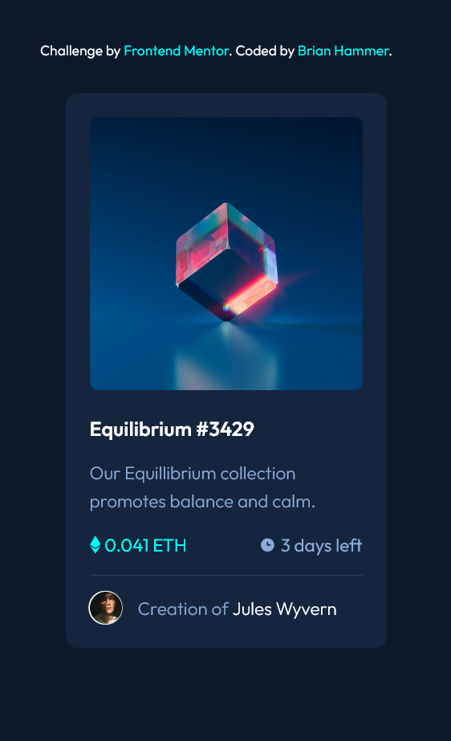

# Frontend Mentor - NFT preview card component solution

This is a solution to the [NFT preview card component challenge on Frontend Mentor](https://www.frontendmentor.io/challenges/nft-preview-card-component-SbdUL_w0U). Frontend Mentor challenges help you improve your coding skills by building realistic projects.

## Table of contents

- [Overview](#overview)
  - [The challenge](#the-challenge)
  - [Picture](#picture)
  - [Links](#links)
- [My process](#my-process)
  - [Built with](#built-with)
  - [What I learned](#what-i-learned)
  - [Continued development](#continued-development)
- [Author](#author)

**Note: Delete this note and update the table of contents based on what sections you keep.**

## Overview

An NFT preview component made using tailwind.

### The challenge

Users should be able to:

- View the optimal layout depending on their device's screen size
- See hover states for interactive elements

### Picture

### Links

- Solution URL: [https://github.com/BrianHammer/nft-card](https://github.com/BrianHammer/nft-card)
- Live Site URL: [https://brianhammer.github.io/nft-card](https://brianhammer.github.io/nft-card)

### Built with

- HTML5
- Tailwind

### What I learned

I have learned how to center an SVG in the middle of an image. I also learned how to use tailwind's group class to trigger animations. Using group allowed me to animate both the profile ring and profile text when hovering.

### Continued development

I would simplify the code more, and look into using more accurate HTML5 tags. I would also adjust font properties such as 'font-space' to make the text match the design better.

## Author

- Frontend Mentor - [@BrianHammer](https://www.frontendmentor.io/profile/BrianHammer)
